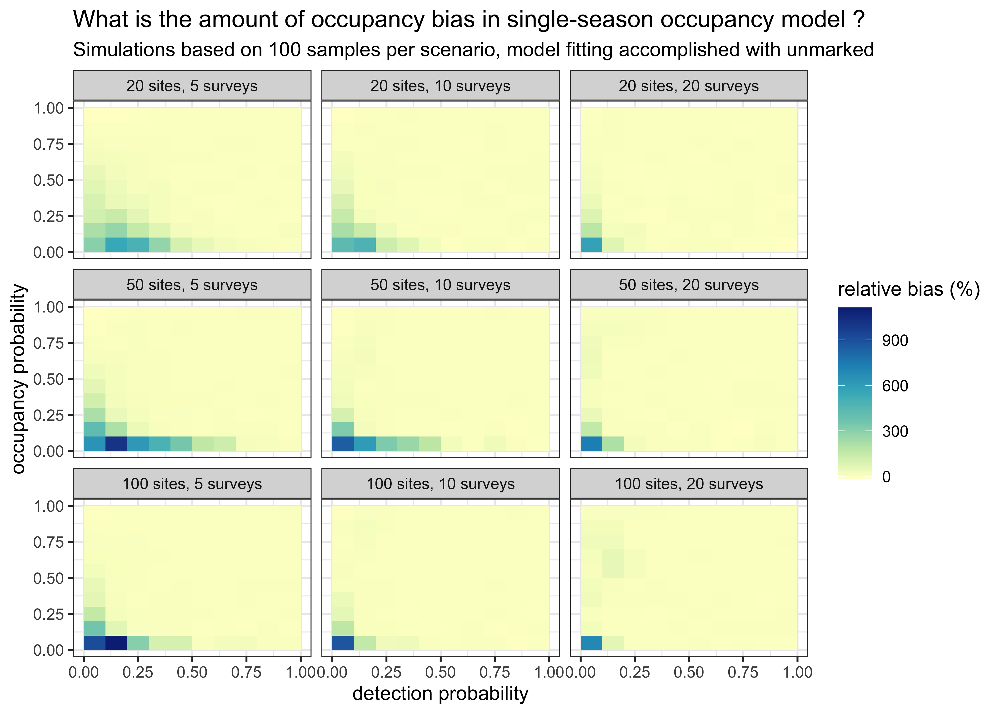

# Bias in occupancy estimate for a static model

Here we provide some R code to calculate bias in occupancy estimate as a function of the detection probability given various levels of occupancy probability, various number of sites and surveys. Check out the interactive app created using flexdashboard [here](https://ecologicalstatistics.shinyapps.io/bias_occupancy/). 

Load package `unmarked` to carry out occupancy analyses:

```r
library(unmarked)
```

Load suite of packages `tidyverse` for data manipulation and visualisation:

```r
library(tidyverse)
```


Define function to carry out simulations:

```r
occu_par <- function(
  nb_sites = 50, # number of sites
  nb_surveys = 5, # number of surveys
  occpr = 0.3, # occupancy prob 
  detpr = 0.5, # detection prob
  n_sim = 500){ # number of simulations

# preallocate memory for storing occupancy estimates
res <- rep(NA, n_sim)

# simulate data from a static occupancy model n_sim times
for (j in 1:n_sim){
  
  # define state process
  z <- rbinom(nb_sites, 1, occpr) # occupancy state
  
  # pre-allocate memory for matrix of detection/non-detections
  y <- matrix(NA, nrow = nb_sites, ncol = nb_surveys) # detection histories
  
  # define observation process
  for(i in 1:nb_sites){
      prob <- z[i] * detpr
      y[i,1:nb_surveys] <- rbinom(nb_surveys, 1, prob)
  }
  
  # format data
  dat <- unmarkedFrameOccu(y)
  
  # fit static occupancy model w/ constant parameters
  fm <- occu(~ 1 ~ 1, dat)
  
  # get estimate of occupancy prob
  res[j] <- backTransform(fm, type = 'state')@estimate
  
}

# return relative bias in %
bias <- round(mean((res - occpr)/occpr) * 100,1)
return(bias)
}
```

Grid on detection, occupancy, number of surveys and number of sites:

```r
det <- seq(0.05, 0.95, by = 0.1)
occ <- seq(0.05, 0.95, by = 0.1)
nsites <- c(20, 50, 100)
nsurveys <- c(5, 10, 20)
```

Define number of simulations per scenario and set the seed for reproducibility:

```r
nsim <- 100
set.seed(666)
```

Initialize a table for storing results:

```r
sim <- tibble(det = double(), 
              occ = double(),
              nsites = double(),
              nsurveys = double(),
              bias = double())
```

Loop within loop within loop...

```r
for (i in det){
  for (j in occ){
    for (k in nsites){
      for (l in nsurveys){
        res <- occu_par(nb_sites = k, 
                        nb_surveys = l, 
                        occpr = j, 
                        detpr = i,
                        n_sim = nsim)
        sim <- sim %>% add_row(det = i,
                               occ = j,
                               nsites = k,
                               nsurveys = l,
                               bias = res)
      }
    }
  }
}
sim
```

```
## # A tibble: 900 x 5
##      det   occ nsites nsurveys  bias
##    <dbl> <dbl>  <dbl>    <dbl> <dbl>
##  1  0.05  0.05     20        5  298 
##  2  0.05  0.05     20       10  425.
##  3  0.05  0.05     20       20  581.
##  4  0.05  0.05     50        5  640.
##  5  0.05  0.05     50       10  847.
##  6  0.05  0.05     50       20  739.
##  7  0.05  0.05    100        5  914.
##  8  0.05  0.05    100       10  882.
##  9  0.05  0.05    100       20  692.
## 10  0.05  0.15     20        5  213.
## # … with 890 more rows
```

Visualize bias:

```r
sim %>%
  mutate(nsites = as_factor(nsites),
         nsites = recode(nsites, 
                         '20' = '20 sites',
                         '50' = '50 sites',
                         '100' = '100 sites'),
         nsurveys = as_factor(nsurveys),
         nsurveys = recode(nsurveys,
                           '5' = '5 surveys',
                           '10' = '10 surveys',
                           '20' = '20 surveys')) %>%
  ggplot() +
  aes(x = det,
      y = occ, 
      fill = bias) +
  geom_tile() +
  scale_fill_distiller(palette = "YlGnBu", 
                       direction = 1,
                       name = 'relative bias (%)') +
  facet_wrap(~ nsites + nsurveys, 
             labeller = label_wrap_gen(multi_line = FALSE), 
             ncol = 3) + 
  labs(x = 'detection probability',
       y = 'occupancy probability',
       title = 'What is the amount of occupancy bias in single-season occupancy model ? ',
       subtitle = 'Simulations based on 100 samples per scenario, model fitting accomplished with unmarked') + 
  theme_bw(base_size = 10)
```

<!-- -->
